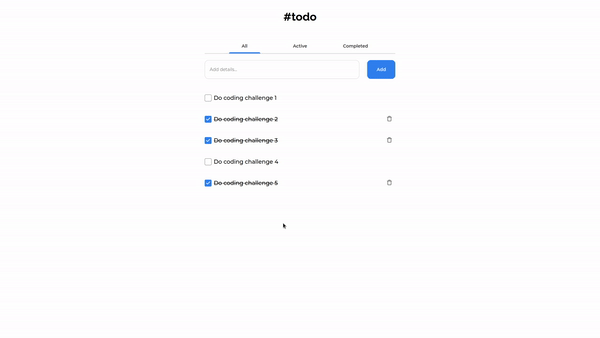

<!-- markdownlint-disable MD033 -->

<h1 align="center">
  
  Todo app
</h1>

<div align="center">
   Solution for a challenge from  <a href="http://devchallenges.io" target="_blank" rel="noopener noreferrer">Devchallenges.io</a>.
</div>

<div align="center">
  <h3>
    <a href="https://nathan22x3.github.io/todo" target="_blank" rel="noopener noreferrer">
      Demo
    </a>
    <span> | </span>
    <a href="https://devchallenges.io/solutions/Ua2TN2AGexBjZ2W7maGH" target="_blank" rel="noopener noreferrer">
      Solution
    </a>
    <span> | </span>
    <a href="https://devchallenges.io/challenges/hH6PbOHBdPm6otzw2De5" target="_blank" rel="noopener noreferrer">
      Challenge
    </a>
  </h3>
</div>

<!-- TABLE OF CONTENTS -->

## Table of Contents

- [Table of Contents](#table-of-contents)
- [Overview](#overview)
  - [Built With](#built-with)
- [Features](#features)
- [How To Use](#how-to-use)
- [Contact](#contact)

<!-- OVERVIEW -->

## Overview



### Built With

- [React](https://reactjs.org/)
- [Redux Toolkit](https://redux-toolkit.js.org/)

## Features

This application/site was created as a submission to a [DevChallenges](https://devchallenges.io/challenges) challenge. The [challenge](https://devchallenges.io/challenges/hH6PbOHBdPm6otzw2De5) was to build an application to complete the given user stories.

- [x] **User story**: Add a new task
- [x] **User story**: Complete a task
- [x] **User story**: Toggle between All, Active and Completed
- [x] **User story**: Remove one or all tasks under the Complete tab
- [x] **User story**: Store the data in local storage that when you refresh the page you can still see your progress

## How To Use

<!-- Example: -->

To clone and run this application, you'll need [Git](https://git-scm.com) and [Node.js](https://nodejs.org/en/download/) (which comes with [npm](http://npmjs.com)) installed on your computer. From your command line:

```bash
# Clone this repository
$ git clone https://github.com/nathan22x3/todo

# Move to the project directory
cd todo

# Install dependencies
$ yarn

# Run the app
$ yarn start
```

## Contact

- GitHub [@nathan22x3](https://github.com/nathan22x3)
